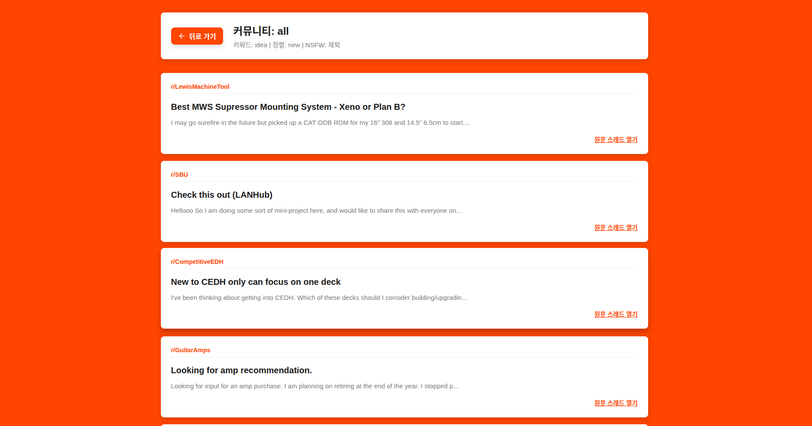

# reddit_serch

## 소개
* Reddit의 다양한 커뮤니티 게시글을 키워드별로 간편하게 탐색할 수 있는 검색 도구입니다.
* 복잡한 API 키 발급 과정 없이 Reddit의 공개 데이터를 활용하여 누구나 즉시 사용할 수 있습니다.

## 주요 화면
| 메인 홈 화면 | 검색 결과 화면 |
| :---: | :---: |
|  |  |

## 주요 기능
* **커뮤니티 선택**: r/all과 같은 전체 커뮤니티는 물론, r/python, r/programming 등 특정 서브레딧을 지정하여 검색할 수 있습니다.
* **키워드 필터링**: Reddit 내의 수많은 게시물 중 사용자가 입력한 키워드와 연관된 정보만 필터링하여 보여줍니다.
* **다중 커뮤니티 동시 검색**: 세미콜론(;)을 사용하여 여러 개의 커뮤니티를 한 번에 검색할 수 있습니다. (예: r/help; r/reactjs)
* **결과 정렬 옵션**: 검색된 결과를 인기순, 최신순, 추천순 등 사용자가 원하는 기준에 맞춰 실시간으로 재정렬할 수 있습니다.
* **카드형 UI**: 게시글의 제목, 커뮤니티 출처, 본문 요약 내용을 카드 형태로 시각화하여 정보 습득 효율을 높였습니다.

## 사용 방법
1. **검색 설정**: 메인 화면에서 검색하고자 하는 키워드를 입력하고 대상 커뮤니티를 선택합니다.
2. **검색 실행**: 검색 버튼을 누르면 해당 조건에 맞는 Reddit 게시글 목록이 화면에 출력됩니다.
3. **정렬 변경**: 결과 화면 상단의 정렬 옵션을 통해 보고 싶은 순서(Top, New, Hot 등)로 목록을 변경합니다.
4. **원문 확인**: 게시글 카드를 클릭하면 해당 Reddit 원문 페이지로 연결되어 전체 내용을 확인할 수 있습니다.

## 결과 정렬 기준
* **Top**: 지정된 기간 내에 가장 많은 추천을 받은 인기 게시물 순서입니다.
* **New**: 가장 최근에 올라온 게시물부터 시간순으로 나열합니다.
* **Hot / Best**: 현재 커뮤니티 내에서 활발하게 논의되고 있는 추천 게시물 위주로 표시합니다.
* **Relevance**: 검색 키워드와 가장 밀접한 연관성을 가진 게시물을 우선적으로 보여줍니다.

## 설치 및 로컬 실행
* **환경 요구사항**: Node.js 환경이 설치되어 있어야 합니다.
* **의존성 설치**: 터미널에서 `npm install` 명령어를 실행하여 필요한 라이브러리를 설치합니다.
* **프로젝트 실행**: `npm run dev` 명령어를 통해 로컬 환경에서 서비스를 구동합니다.
* **브라우저 접속**: 실행 후 안내되는 로컬 주소(보통 http://localhost:5173)로 접속하여 사용합니다.

## 주의 사항
* 본 서비스는 Reddit의 공개 JSON 엔드포인트를 사용하므로, 짧은 시간 내에 과도한 검색 요청 시 일시적으로 접속이 제한될 수 있습니다.
* 브라우저의 CORS 정책 문제를 해결하기 위해 Vite Proxy 설정을 기반으로 작동합니다.
